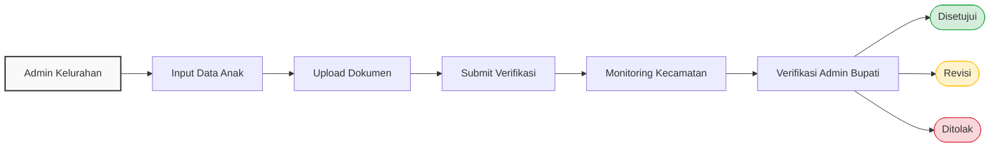

# BAB 1: Pendahuluan

## 1.1 Latar Belakang
Sebelumnya, pendataan anak yatim penerima bantuan di Kabupaten Pelalawan masih dilakukan secara manual atau menggunakan data yang tersebar di berbagai instansi. Hal ini sering kali menimbulkan berbagai kendala, seperti keterlambatan proses verifikasi berjenjang, sulitnya melakukan *monitoring* secara *real-time*, hingga kendala dalam penyusunan laporan rekapitulasi.

Untuk menyelesaikan permasalahan tersebut, dibangunlah SAHABAT (Sistem Administrasi Hibah Bantuan Anak Yatim). SAHABAT merupakan aplikasi berbasis web yang dirancang khusus sebagai solusi digital untuk menyederhanakan dan mengintegrasikan proses pendataan, pengelolaan dokumen, verifikasi, hingga pelaporan administrasi anak yatim secara terpusat.

## 1.2 Dasar Hukum
Pelaksanaan sistem SAHABAT dilandasi oleh peraturan-peraturan berikut:
* [Peraturan Daerah Kabupaten Pelalawan Nomor ... Tahun ...]
* [Peraturan Bupati Pelalawan Nomor ... Tahun ...]
* [Surat Keputusan Bupati Nomor ...]
* [Peraturan terkait lainnya]

## 1.3 Tujuan Sistem
Penggunaan aplikasi SAHABAT ditujukan untuk:
* Meningkatkan akurasi dan validitas data penerima bantuan.
* Mengurangi risiko duplikasi data anak yatim antar wilayah.
* Meningkatkan transparansi dan akuntabilitas proses pengajuan.
* Menyediakan rekam jejak (*histori*) perubahan data untuk mendukung proses audit.
* Mendukung proses *monitoring* secara lintas wilayah dari tingkat Kelurahan hingga Kabupaten.

## 1.4 Ruang Lingkup Sistem
Aplikasi SAHABAT mencakup modul dan fitur operasional berikut:
1. Pendataan Anak (Identitas, Orang Tua, Wali, Pendidikan).
2. Pengelolaan Dokumen Persyaratan Digital.
3. Verifikasi Data Berjenjang (Alur Persetujuan/Revisi/Penolakan).
4. Pelaporan dan Rekapitulasi Data.
5. Manajemen Pengguna dan Wilayah.
6. Pencatatan Log Aktivitas (*Audit Log*).

**Batasan Sistem:**
Aplikasi SAHABAT **bukan** merupakan sistem pengelolaan keuangan daerah dan **tidak digunakan** untuk proses pencairan dana hibah secara langsung. Sistem ini berfokus murni pada administrasi pendataan, verifikasi syarat, pengelolaan dokumen, dan pelaporan status anak penerima bantuan.

## 1.5 Sasaran Pengguna
Sistem ini beroperasi dengan batasan hak akses yang ketat. Setiap pengguna hanya dapat mengakses modul dan data sesuai dengan kewenangannya:
1. **Superadmin:** Mengelola konfigurasi sistem, memantau *audit log*, serta mengatur manajemen pengguna (*User, Role, Permission*) dan data wilayah.
2. **Admin Bupati:** Memiliki kewenangan untuk melakukan ulasan (*review*), memverifikasi data (menyetujui, menolak, atau meminta revisi), serta memantau laporan di tingkat Kabupaten.
3. **Admin Kecamatan:** Memiliki hak akses untuk melakukan *monitoring* dan melihat statistik data seluruh kelurahan yang berada di bawah wilayah administrasinya.
4. **Admin Kelurahan:** Bertindak sebagai operator lapangan yang bertugas menginput data anak, mengunggah dokumen, dan memantau status pengajuan di wilayah kelurahannya.

## 1.6 Persyaratan Penggunaan Sistem
Untuk dapat menggunakan sistem SAHABAT, pengguna harus memastikan hal-hal berikut:
* Memiliki koneksi jaringan internet yang stabil.
* Memiliki akun pengguna yang berstatus aktif.
* Menggunakan *Username/Email* dan *Password* yang sah.
* Memiliki hak akses (*Role*) dan pembagian wilayah yang telah ditetapkan oleh Superadmin.
* Menggunakan peramban web (*browser*) modern (seperti Google Chrome, Mozilla Firefox, atau Microsoft Edge) yang diperbarui untuk kenyamanan akses antarmuka.

## 1.7 Istilah dan Singkatan
* **SAHABAT:** Sistem Administrasi Hibah Bantuan Anak Yatim.
* **Draf:** Status awal data anak yang sedang diisi oleh Kelurahan dan belum diajukan.
* **Verifikasi:** Proses pengecekan keabsahan data dan dokumen oleh Admin Bupati.
* **Audit Log:** Catatan riwayat aktivitas yang merekam setiap tindakan (tambah, ubah, hapus) di dalam sistem.

# BAB 2: Pengenalan Sistem

## 2.1 Gambaran Umum Sistem
SAHABAT dirancang sebagai platform terpadu yang memusatkan seluruh aktivitas pengelolaan bantuan hibah anak yatim. Sistem ini menghubungkan berbagai tingkat pemerintahan (Kelurahan, Kecamatan, dan Kabupaten) ke dalam satu lingkungan digital yang sama. Dengan konsep ini, setiap pemangku kepentingan dapat bekerja pada data yang sama secara *real-time* sesuai dengan kewenangan masing-masing, meminimalisir redudansi, dan mempercepat proses birokrasi.

## 2.2 Alur Bisnis
Proses pendataan di dalam aplikasi SAHABAT mengikuti alur birokrasi yang berjenjang. Proses dimulai oleh Admin Kelurahan melalui menu Data Anak. Setelah seluruh identitas dan dokumen persyaratan dilengkapi, data tersebut diajukan untuk proses verifikasi. 

Di tingkat selanjutnya, Admin Kecamatan memiliki hak untuk melakukan pemantauan terhadap seluruh data yang diajukan pada wilayah administrasinya tanpa dapat mengubah isi data. Terakhir, Admin Bupati melakukan pemeriksaan administrasi tingkat kabupaten dan memberikan keputusan akhir, yaitu berupa persetujuan, permintaan revisi kembali ke kelurahan, atau penolakan. Seluruh aktivitas perubahan status ini dicatat secara otomatis ke dalam *Audit Log* sehingga dapat ditelusuri kembali apabila diperlukan.

## 2.3 Diagram Alur Bisnis
Visualisasi di bawah ini menggambarkan perjalanan data dari tahap input hingga keputusan akhir:

